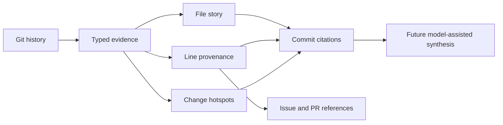

# ChangeAtlas

> Software archaeology with evidence: understand why code exists, not only what it does.

ChangeAtlas reconstructs the evolution of a codebase from Git history and returns
answers that cite their sources. It can reconstruct a file's history, attribute a
specific current line to its last-changing commit, surface intent references from
that commit, and rank architectural hotspots by change frequency and line churn.

## Why this is not another repository chatbot

Most code assistants read the current snapshot and produce a plausible summary.
ChangeAtlas starts with an evidence graph:



- No API key and no network are required for the core workflow.
- Every explanation retains commit SHAs and, when available, clickable URLs.
- Git commands use argument arrays rather than a shell.
- The evidence layer is deterministic and testable before any LLM is introduced.
- The architecture is designed for future PR, issue, test, and ADR adapters.

## Try it

```bash
python -m venv .venv
source .venv/bin/activate
python -m pip install -e ".[dev]"

change-atlas --repo /path/to/repository file src/payment/retry.py
change-atlas --repo /path/to/repository why src/payment/retry.py --line 42
change-atlas --repo /path/to/repository hotspots --limit 10
change-atlas --repo /path/to/repository graph --output evidence-graph.json
```

Machine-readable output is available with `--json`:

```bash
change-atlas --repo . file change_atlas/git_history.py --json
change-atlas --repo . why change_atlas/git_history.py --line 42 --json
```

## Example answer contract

```json
{
  "path": "service.py",
  "summary": "service.py is first explained by …",
  "evidence": [
    {
      "sha": "…",
      "subject": "fix: cap retry budget",
      "url": "https://github.com/owner/repo/commit/…"
    }
  ]
}
```

## Current scope

- Follow a file through renames with `git log --follow`.
- Capture author, timestamp, subject, body, paths, additions, and deletions.
- Normalize HTTPS and SSH GitHub remotes into commit citations.
- Explain a file using its origin and latest evolution.
- Attribute a current line to its last-changing commit with `git blame`.
- Extract local and cross-repository GitHub issue, PR, and commit references from intent text.
- Rank hotspots by commit count and line churn.
- Export a deterministic temporal graph linking commits to files and intent references.
- Test the complete workflow against temporary real Git repositories.

## Roadmap

- Add test and ADR evidence to the temporal graph alongside existing issue and PR references.
- Detect architectural decision points instead of treating every commit equally.
- Add evaluation fixtures for citation completeness and temporal faithfulness.
- Add an optional local or hosted model adapter that can only summarize supplied evidence.
- Visualize how a subsystem changed across releases.

The foundational rule is documented in
[ADR 0001: Evidence before generation](docs/adr/0001-evidence-before-generation.md).

## Development

```bash
python -m pip install -e ".[dev]"
python -m pytest
```

CI runs the test suite on Python 3.11, 3.12, and 3.13.
